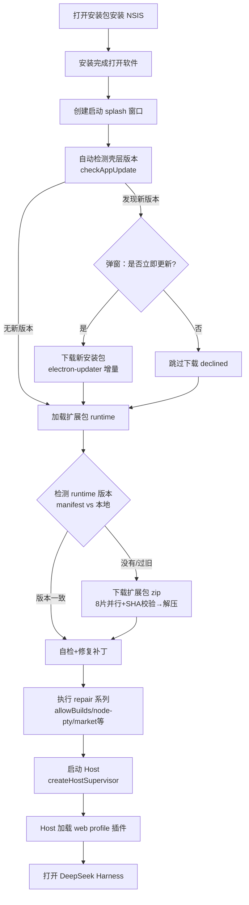

# DeepSeek Harness Desktop 开发注意事项

本仓库是 Electron 桌面壳，加载本地构建的 `dsh web` Host 页面。定制 UI/行为时**绝不改上游**，一切写在本地项目逻辑里。

## 铁律（违反必出 bug）

### 1. 绝不修改 `upstream/` 目录
- `upstream/` 是 `pnpm run prepare:upstream` 从 GitHub 克隆的上游 monorepo
- 上游改动会被 `git checkout` / `sync-upstream` 覆盖，**其他仓库同步不到**，用户明确要求不改
- 所有定制一律写在本地：`src/main.ts` 的注入 JS、`resources/`（preload、splash、plugin-manager）等

### 2. 注入 JS 是「纯 JavaScript」，禁止 TS 类型标注
`src/main.ts` 里 `window.webContents.on('did-finish-load', () => executeJavaScript(...))` 注入的代码会被**原样打包进 `lib/main.js` 的模板字符串**，由渲染进程按纯 JS 执行：
- ❌ 禁止 `let x: Node | null` 之类的类型标注 → 整段抛 `SyntaxError`，且被 `.catch(() => {})` 静默吞掉，表现为「刷新后改动失效/改回去」。用 `let x` 即可
- ❌ 禁止在注入代码里写反引号 `` ` ``（会提前截断外层模板字符串，导致 tsc 报错）
- 注入脚本开头 `if (typeof window.desktop === 'undefined') return` 保持——浏览器打开页面时不注入

### 3. 改页面文案：只改文本节点，绝不碰样式
- ❌ 禁止 `el.textContent = 'xxx'`：会销毁子节点；且 `querySelectorAll('span')` 匹配文本时外层/里层 span 都会命中，外层赋值会连里层 class 一起清掉 → 字体字号颜色全变
- ❌ 禁止 `badge.style.display = 'none'` 之类样式操作
- ✅ 正确做法：`document.createTreeWalker(document.body, NodeFilter.SHOW_TEXT)` 遍历**叶子文本节点**，只改 `textNode.nodeValue`。元素结构、class、字体、颜色、布局完全不动

### 4. 注入后挂 MutationObserver 兜底
React 重渲染 / 页面刷新会把被改的文案写回原值，必须挂监听再锁回：

```js
const fix = () => { /* TreeWalker 改文本 */ }
fix()
new MutationObserver(fix).observe(document.body, { childList: true, subtree: true, characterData: true })
```

（已实测：手动把标题改回「DSH 本地构建」后 1.5 秒内被自动锁回 DeepSeek Harness。）

### 5. 窗口标题已硬编码为 DeepSeek Harness
`createMainWindow()` 已把所有路径（创建时 `title`、`page-title-updated`、`did-navigate`、`did-navigate-in-page`、`did-finish-load`）锁定为 `APP_NAME = 'DeepSeek Harness'`。不要移除这些锁定；如需改名只改 `APP_NAME` 常量。

## 已有定制点（本地注入，勿再改上游实现）

- **侧边栏品牌标题**：上游 i18n `brand.localBuild`（zh=「DSH 本地构建」/ en=「DSH Local Build」），本地注入 TreeWalker 把文本固定为 `DeepSeek Harness`
- **窗口标题栏**：`createMainWindow` 锁定 `APP_NAME`
- **主题同步**：注入 JS 监听 `body[data-ds-dark-theme]` 属性同步原生标题栏
- **「打开配置文件」按钮**：注入 JS 拦截，走主进程 IPC（`desktop:open-document`），绕过 Host API 隐藏窗口站问题

## 桌面端启动流程（安装 → 打开，与用户约定的规范）

> 用户约定的流程规范：安装 → 打开 → 自动检版本（非最新→提示下载/跳过）→ 加载扩展包(runtime 无则下载) → 自检修复补丁 → 执行补丁/直接打开。下面对照当前实现逐步说明。



### 各步骤代码位置

| 步骤 | 代码 | 说明 |
|---|---|---|
| 1. 安装 | NSIS 安装器 | — |
| 2. 打开 → splash | `src/main.ts` `boot()` → `createSplashWindow` | — |
| 3. 壳层版本检测 | `boot()` → `checkAppUpdate(false)`（`src/updater.ts`） | 非最新弹窗「发现新版本，是否立即更新」；是→`downloadUpdate`（增量），否→`declined` 跳过 |
| 4. 加载扩展包(runtime) | `resolveHostPaths` → `ensureRuntime`（`src/runtime-bootstrap.ts`） | manifest 版本检测：无/旧→下载 zip(8片并行+SHA 校验)→解压；版本一致→直接复用 |
| 5. 自检+修复补丁 | `boot()` 里串行执行 `repair*` 系列 | 每次启动自动执行、幂等；相当于"修复补丁" |
| 6. Host 启动 | `createHostSupervisor` → `spawnDshWeb` | — |
| 7. 打开主窗口 | Host 加载 web profile 插件后 | — |

### 自动修复函数（启动时按序废弃执行）

- `repairProfileAllowBuildsPlaceholders`（`src/main.ts` ~L677）：修 pnpm 写的 `set this to true or false` 占位 bug → `true`
- `repairProfileNodePtyOverrides`（~L781）：把 profile 的 `node-pty` 固定到 `file:./vendor/node-pty`（本地 vendor，绕开下载源裁剪 prebuilds）；落盘 `repair.log`
- `ensureOfficialMarketBundle`：确保插件市场 bundle 进 web profile
- `ensurePluginRuntimeLinks`：确保已启用插件能解析运行时 peer 依赖
- `repairProfileDeepSeekAiScopeOverlay`：修复旧版 `@deepseek-ai` scope 覆盖目录
- `rebuildMissingPluginEntries`：重建主入口缺失的插件

### ⚠️ 边界：用户装的第三方插件不在此自愈范围

自动修复只覆盖 runtime/系统级问题，**不替用户改第三方插件版本**。用户 profile 里装的插件（如 `dsh-better-sidebar`）若版本与 runtime API 不兼容（例：旧版 import `settingsNamespace` 而新版 dsh-settings 已删），启动即崩，但 repair 不会动它——需手动升级插件到兼容版本。若某插件反复被改回旧版本导致崩，可考虑给它也做启动自愈（类似 node-pty 的 vendor/pin 方式），但默认不自动改用户插件。

## 构建 / 运行 / 验证

```sh
pnpm install                    # 根依赖；Electron 二进制失败时：
                                #   $env:ELECTRON_MIRROR="https://npmmirror.com/mirrors/electron/"; node node_modules\electron\install.js
pnpm run prepare:upstream       # 克隆 + 构建上游（首次必需）
pnpm run build:shell            # tsc + tsdown → lib/main.js
pnpm run dev                    # 重新构建壳层 + electron .
```

### CDP 实测渲染进程（验证注入是否真生效）
```sh
pnpm exec electron . --remote-debugging-port=9222   # 启动
Invoke-RestMethod http://127.0.0.1:9222/json/list    # 取 target 的 webSocketDebuggerUrl
```
写 Node 脚本连 WebSocket，`Runtime.evaluate` 查 DOM、`Page.reload` 模拟 F5 刷新。

## 排查 checklist（改动没生效时按序查）

1. `lib/main.js` 里 `Select-String -Pattern` 搜注入代码段，确认**无 `: Node | null` 等 TS 标注、无反引号**
2. CDP 连渲染进程，`Runtime.evaluate` 手动跑注入逻辑看是否报错
3. 确认 `window.desktop` 存在（preload 注入），注入开头 `if undefined return` 没提前退出
4. 确认是 Electron 窗口而非浏览器标签页（浏览器没有 preload 注入）
