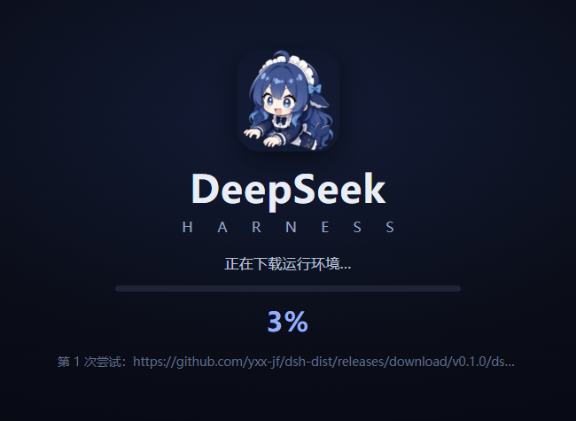

# DeepSeek Harness Desktop

[English](README.md) | 中文

为 [DeepSeek Harness](https://github.com/deepseek-ai/deepseek-harness)（DSH）插件生态打造的桌面端解决方案：把官方 Web UI 带到原生桌面窗口，一键安装、系统托盘、两步安装、在线更新。

## 立即下载

- **Windows**：[下载最新安装包](https://github.com/yxx-jf/deepseek-harness-desktop/releases/latest)
- macOS：敬请期待



## 主要功能

| 功能 | 说明 |
| --- | --- |
| 桌面应用封装 | 把官方 DSH 的本地 Web UI 带到原生窗口，无需安装 Node.js 或执行命令 |
| 两步安装 | 小安装包快速落地，首次启动自动下载运行环境 |
| 运行时自动更新 | 每次启动检查远程运行时，发现新版即静默更新 |
| 应用内升级 | 检查 GitHub Releases 上的最新安装包，一键下载安装、重启完成升级 |
| 系统托盘 | 托盘常驻，一键显示/隐藏主窗口 |

## 在线更新

两层更新机制让应用始终保持最新：

1. **运行时更新**：启动时对比远程 `runtime-manifest.json`，发现新版本即下载并原子替换，无需重新安装。
2. **应用更新**：检查 GitHub Releases 上的最新安装包，下载后一键安装升级。

## 与官方项目的关系

本项目基于 [deepseek-ai/deepseek-harness](https://github.com/deepseek-ai/deepseek-harness) 构建。

官方项目提供核心的智能体能力、插件系统和 Web UI。本项目主要负责：

- 桌面应用封装
- 本地服务的启动、停止与恢复
- 桌面窗口和系统托盘集成
- Windows 安装包构建与发布
- 更适合桌面的界面体验

> 本项目是社区桌面版本，并非 DeepSeek 官方产品。如需通过命令行运行 Harness，请优先使用[官方仓库](https://github.com/deepseek-ai/deepseek-harness)。

## 开发

同步官方最新代码并重新打包：

```sh
git fetch origin && git merge origin/master
pnpm install
pnpm run build
pnpm --filter @deepseek-ai/dsh-desktop run dist:win:fast
```

桌面端代码位于 `apps/desktop/`。发布运行时使用：

```sh
pnpm --filter @deepseek-ai/dsh-desktop run publish:runtime --url <base> --write-config
```

详见 [apps/desktop/README.md](apps/desktop/README.md)。

## 许可证

[MIT](LICENSE)

本项目完全开源免费。如果有人向您以任何形式出售此软件，请拒绝交易。
